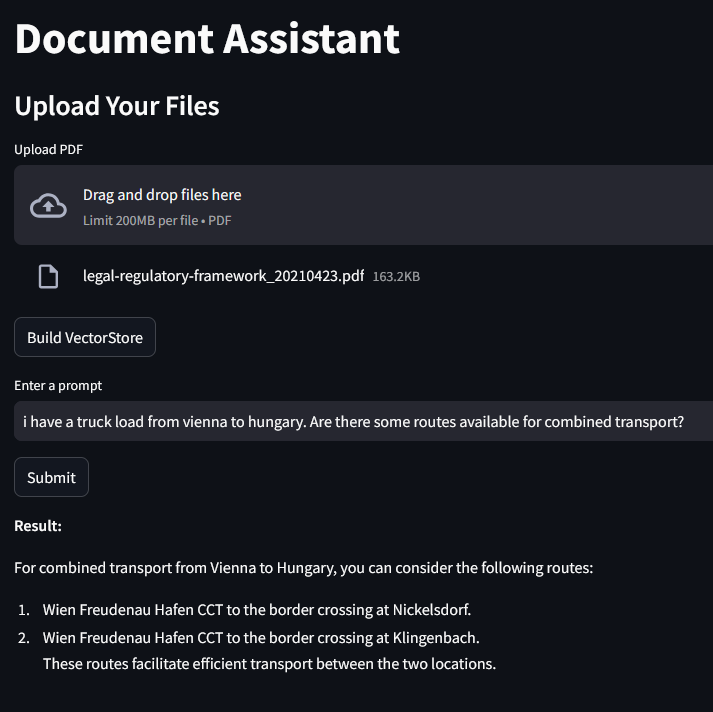
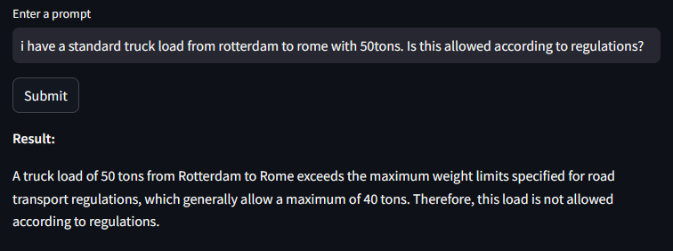
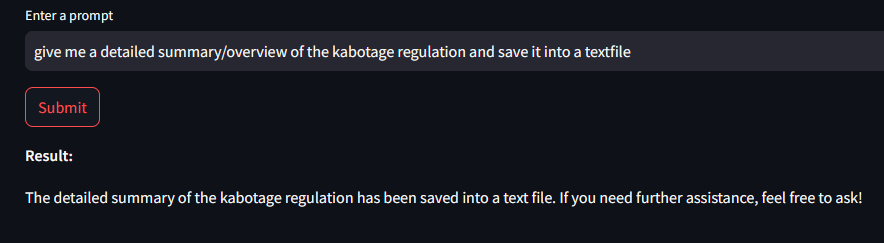
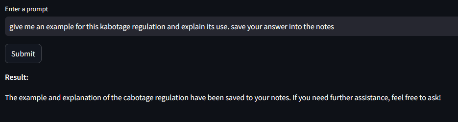
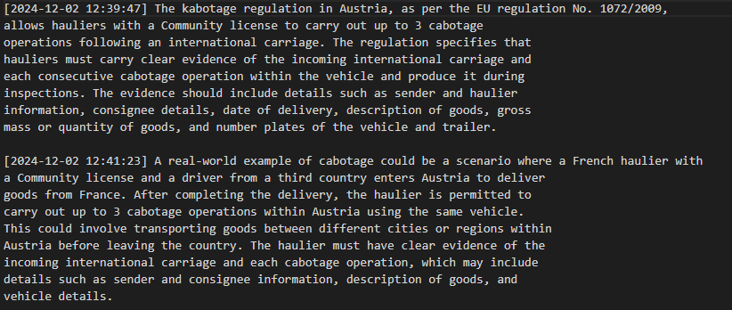

# AI Co-Worker

This project creates an AI Agent which is able to assist an user and give him specific information based on a RAG system with user provided documents. The idea is that the user assigns the desired file to this agent which analyses and reads through them rather than doing this manually in order to save a lot of time. The user can then order the agent to perform different tasks for example summarise, analyse, giving more insights on some topics, translate, create new texts and so on. Specifically, this agent can - if requested - create and save all these results in a seperate notes.txt file into the same folder.

This project specifically is tailored to transport companies which plan shipments. For this, they have to consider a lot of contraints for example legal regulations. Time consuming file evaluation can be outsourced now to this agent in seconds.

Project components: folder **data** which contains all the files the agent should have access to, the main.py file, requirements.txt file, nove_engine.py, a rag_agent.ipynb and the very important vectorstore.py file. The **vectorstore.py** which creates a vectorstore which contains all the embeddings which were created from the files. Embeddings are numerical presentation of stored in arrays. These consequently become stored in an virtual multidimensional room. Later on, when the AI works with this it calculates the distances betweens these arrays in order to determine their closeness and therefore the context of the text. This virtual room is the vectorestore. It automatically is saved as a **chroma_db** file.

1. In the _main.py_ the user can interact with the agent and order him tasks or give him question about the documents. Furthermore, it is able to create notes as a textfile with any text for later usage. The user selects through a windows the desired files and with this it creates the vectorstore database. This whole file run as a userfriendly streamlit application. To start app, run "streamlit run main.py" in terminal. Note, that you can adjust the prompt anytime so it fits to your wanted behaviour.

2. The _note_engine.py_ creates the tool which enables the agent to create and save the results of any user requierements. The respective notes get a unique timestamp with id and are added incrementally to file meaning that previous notes stay preserved if so wanted. 

3. An ._env_ saves an OPEN AI API key for the AI model used for this project (adjust it with your own API key). 

4. The _requirements.txt_ file lists all packages needed for this project **(run pip install -r requirements.txt)**. I personally recommend to create a virtual environment for this project. 

5. Finally, th _rag_agent.ipynb_ notebook file gives on overview the the basic structure/framework of the foundation and how the basis of it works.

## Getting started

To set up this repo create a folder for the project on your system (instructions for windows), open a terminal window, write "cd" and paste the folder path `cd "C:\Users\user\path\to\your\folder"`. Then type `git clone https://github.com/Yesitin/AI-Co-Worker.git` to download the whole repository (ensure that you have installed python and git). 

Next, create a virtual environment in order to avoid dependency conflicts. For this, type into the terminal `python -m venv env`. With `env\Scripts\activate` you start the environment.

Now you can install all dependencies with `pip install -r requirements.txt`. 

As a last step, you have to create a .env file and insert and OpenAI key: `OPENAI_API_KEY=your_api_key`. Replace your_api_key with your actual key.

Finally, you have to enter `python -m streamlit run main.py` in your activated virtual environment terminal and the app will start. 

## Use examples

#### 1) In this example I pretend to look for a transport execution with combined transport. For this, I feed the vectorstore with a certain documment and ask the agent for help. It can now provide me information about this based on the document:

#### 2) Here I ask the agent if a certain transport would be allowed considering european legislation. It negates my question since such transport is clearly restricted:

#### 3.1) In this example I asked the agent to summarise me a certain regulation and save it into a local textfile. Subsequently, I requested for an example to point it out. Eventually, the notes file contains the output together with a unique time stamp plus id: 

#### 3.2) Request for example

#### 3.3) The output notes.txt file

